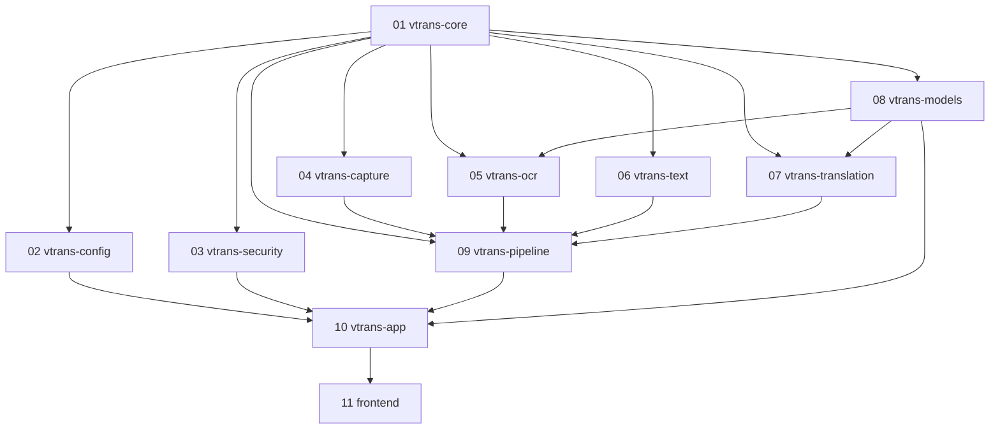

# VTrans 架构规格文档

> 基于 windows_screen_translator_agent_spec.md 细化拆分。
> 目标：将 11 个模块分别交付给独立 Agent 开发。

## 1. 项目概述

VTrans 是一款 Windows 桠面屏幕翻译工具，支持手动框选翻译和固定区域实时翻译。

技术栈：Rust + Tauri 2 + React + TypeScript + ONNX Runtime + Tokio。

核心原则：屏幕采集、OCR、翻译、展示互相隔离，主流程只依赖统一 trait 和标准数据结构。

## 2. 模块拆分总览

| # | 模块名 | Crate | 分支 | 依赖 | 层级 |
|---|--------|-------|------|------|------|
| 01 | 核心类型 | vtrans-core | feat/01-core | 无 | 0 |
| 02 | 配置管理 | vtrans-config | feat/02-config | core | 1 |
| 03 | 凭据安全 | vtrans-security | feat/03-security | core | 1 |
| 04 | 屏幕采集 | vtrans-capture | feat/04-capture | core | 2 |
| 05 | OCR | vtrans-ocr | feat/05-ocr | core, models | 2 |
| 06 | 文本标准化 | vtrans-text | feat/06-text | core | 1 |
| 07 | 翻译引擎 | vtrans-translation | feat/07-translation | core, models | 2 |
| 08 | 模型管理 | vtrans-models | feat/08-models | core | 1 |
| 09 | 流水线 | vtrans-pipeline | feat/09-pipeline | core, capture, ocr, text, translation | 3 |
| 10 | 应用层 | vtrans-app | feat/10-app | 全部 | 4 |
| 11 | 前端 | src/ | feat/11-frontend | app | 4 |

**层级含义**：层级 N 的模块只能依赖层级 < N 的模块。同一层级的模块可以并行开发。

## 3. 依赖关系图



## 4. 开发阶段与模块分配

### Phase 0：基础骨架（1 Agent）

| 模块 | 内容 | 验收 |
|------|------|------|
| 01 vtrans-core | 核心类型、错误类型、Provider traits、日志初始化 | workspace 可编译 |

此阶段产出是所有后续模块的基础。Agent 在 feat/01-core 分支完成后合并到 main，其他 Agent 从 main 拉取最新代码开始各自分支。

### Phase 0.5：契约冻结（审查，不分配 Agent）

Phase 0 合并后、Phase 1 启动前，进行一次架构审查，确保以下契约冻结：

1. 所有跨模块类型（Language、ScreenRegion、CapturedImage、OcrResult 等）已在 vtrans-core 中定义且 serde 表示确定。
2. 所有 Provider trait（OcrProvider、TranslationProvider、CaptureSource、CaptureSession）签名固定。
3. 所有 trait 相关错误类型（CaptureError、OcrError、TranslationError）变体完整，覆盖各模块文档中定义的所有情况。
4. AppConfig schema 包含所有模块需要的配置字段（capture、ocr、translation、hotkeys、log_level、model_dir）。
5. ModelManifest schema 覆盖 OCR 和 translation 模块的需求。
6. PipelineDeps 形状确定。

冻结后 core 的修改需走变更评审，通知所有下游 Agent rebase。

### Phase 1：独立模块（4 Agents 并行）

| 模块 | 内容 | 前置条件 |
|------|------|---------|
| 02 vtrans-config | 配置 schema、持久化、迁移、默认值 | Phase 0 合并 |
| 03 vtrans-security | Credential Manager 集成、API Key 存取 | Phase 0 合并 |
| 06 vtrans-text | 文本清洗、行合并、指纹去重、段落切分 | Phase 0 合并 |
| 08 vtrans-models | 模型清单 schema、SHA-256 校验、生命周期 | Phase 0 合并 |

### Phase 2：功能模块（3 Agents 并行）

| 模块 | 内容 | 前置条件 |
|------|------|---------|
| 04 vtrans-capture | Graphics Capture、多显示器、DPI 转换 | Phase 0+1 |
| 05 vtrans-ocr | PP-OCR ONNX 检测+识别、预处理/后处理 | Phase 0+1 |
| 07 vtrans-translation | API + Local ONNX Provider、取消/超时/重试 | Phase 0+1 |

### Phase 3：流水线集成（1 Agent）

| 模块 | 内容 | 前置条件 |
|------|------|---------|
| 09 vtrans-pipeline | 捕获-OCR-翻译编排、帧差检测、有界通道；多框实时翻译（MultiBoxPipeline：每框独立任务/取消、结果广播、错误隔离） | Phase 0-2 |

### Phase 4：应用与前端（2 Agents 并行）

| 模块 | 内容 | 前置条件 |
|------|------|---------|
| 10 vtrans-app | Commands/Events、AppState、全局快捷键；多框生命周期（翻译框持久化、forwarder、状态轮询、结果窗口） | Phase 0-3 |
| 11 frontend | React 三窗口 UI、状态管理、IPC | Phase 0-3 |

## 5. 横切标准

以下标准对所有模块强制执行，不遵守的 PR 不予合并。

### 5.1 日志规范

库选择：tracing + tracing-subscriber + tracing-appender

日志级别约定：

| 级别 | 用途 | 示例 |
|------|------|------|
| ERROR | 不可恢复的错误 | OCR 模型加载失败、捕获会话崩溃 |
| WARN | 可恢复的异常 | API 超时重试、显示器断开 |
| INFO | 关键生命周期事件 | 流水线启动/停止、翻译完成 |
| DEBUG | 调试诊断信息 | 帧差检测结果、OCR 行数 |
| TRACE | 极细粒度追踪 | 像素差异值、张量 shape |

日志格式：
- 开发环境：控制台输出，带时间戳和着色
- 生产环境：滚动日志文件，按小时轮转，保留 5 个文件
- 日志路径：Tauri AppConfig 目录下的 logs/ 子目录

敏感数据红线：
- 禁止记录 API Key、Bearer Token、用户原文完整内容、译文完整内容
- 需要引用文本时只记录前 20 字符 + ...
- 需要引用 Key 时只记录 sk-****1234（前缀掩码）
- 截图图像数据禁止出现在日志中

每个 crate 的日志要求：
- 入口函数（公开 API）使用 #[tracing::instrument] 注解
- 错误路径必须 warn 或 error 级别记录
- 复用 vtrans-core::logging 提供的初始化函数

### 5.2 错误处理规范

原则：
- 每个 crate 定义自己的错误枚举，使用 thiserror::Error 派生
- crate 内部错误不上报为 anyhow::Error，保持类型信息
- 应用边界（Tauri command 返回值）使用 anyhow::Error 或统一错误类型
- 错误链必须保留：source() 正确实现

错误命名约定：
```
vtrans-core:       CoreError, CaptureError, OcrError, TranslationError
vtrans-config:      ConfigError
vtrans-security:    SecurityError
vtrans-text:        TextError
vtrans-models:      ModelError
vtrans-pipeline:    PipelineError
vtrans-app:         AppError
```

> **说明**：`CaptureError`、`OcrError`、`TranslationError` 定义在 vtrans-core 中，因为对应的 Provider trait 需要引用它们。各实现 crate 从 vtrans-core 导入，不重新定义。其余错误类型由各自 crate 自行定义。

### 5.3 测试规范

测试分层：

| 类型 | 位置 | 要求 |
|------|------|------|
| 单元测试 | src/*.rs 内 #[cfg(test)] mod tests | 覆盖核心逻辑，无外部依赖 |
| 集成测试 | tests/*.rs | 跨模块交互，可 mock 外部依赖 |
| 验证 CLI | examples/*.rs | 独立验证 ONNX 模型、Tokenizer 等 |

覆盖率要求：
- 纯逻辑模块（core, text, config）：核心函数覆盖率 > 80%
- 平台相关模块（capture, security）：关键路径有集成测试
- 推理模块（ocr, translation）：提供验证 CLI + 最低限度单元测试

测试数据：
- tests/fixtures/ 目录存放固定测试素材（图片、文本样本）
- 图片素材不超过 100KB，文本样本不超过 10KB
- 模型文件不提交 Git，通过 manifest 和下载脚本管理

### 5.4 代码风格

- cargo fmt --all 零差异
- cargo clippy --all 零警告（workspace 级 pedantic 已启用）
- 公开 API 必须有 rustdoc 注释，包括参数说明和示例
- 公开 trait 方法标注 #[async_trait]
- unsafe 代码需要 // SAFETY: 注释说明安全条件

### 5.5 文档规范

- 每个 crate 根目录有 README.md，包含：模块职责、依赖关系、公开 API 概要、构建/测试命令、已知限制
- 架构文档 docs/ARCHITECTURE.md（本文档）是全局参考
- 模块详细规格在 docs/modules/NN-*.md
- 开发环境说明在 docs/DEVELOPMENT.md
- Git 工作流在 docs/GIT_WORKFLOW.md

## 6. 核心接口契约

以下类型和 trait 定义在 vtrans-core 中，所有模块共享。任何模块不得定义重复类型，必须从 vtrans-core 导入。

### 6.1 核心数据结构

```rust
pub enum Language { Auto, ChineseSimplified, Japanese, English }

pub struct ScreenRegion {
    pub monitor_id: String,
    pub x: i32, pub y: i32,
    pub width: u32, pub height: u32,
}

pub enum PixelFormat { Rgba8, Bgra8 }

pub struct CapturedImage {
    pub width: u32,
    pub height: u32,
    pub format: PixelFormat,
    pub data: Vec<u8>,
}

pub struct OcrLine {
    pub text: String,
    pub confidence: f32,
    pub polygon: [[f32; 2]; 4],
    pub reading_order: usize,
}

pub struct OcrResult {
    pub lines: Vec<OcrLine>,
    pub merged_text: String,
    pub detected_language: Option<Language>,
    pub elapsed_ms: u64,
}

pub struct OcrOptions {
    pub language: Language,
    pub min_confidence: f32,
    pub detect_vertical: bool,
}

pub struct TranslationRequest {
    pub text: String,
    pub source: Language,
    pub target: Language,
}

pub struct TranslationResult {
    pub translated_text: String,
    pub provider_id: String,
    pub elapsed_ms: u64,
}

pub enum PipelineMode { SingleCapture, LiveRegion }

pub enum PipelineStatus {
    Idle, Capturing, OcrInProgress,
    Translating, Completed, Error(String),
}
```

### 6.2 Provider Traits

```rust
[async_trait::async_trait]
pub trait OcrProvider: Send + Sync {
    fn id(&self) -> &'static str;
    async fn recognize(
        &self, image: &CapturedImage, region: &ScreenRegion,
        options: &OcrOptions, cancel: CancellationToken,
    ) -> Result<OcrResult, OcrError>;
    fn supported_languages(&self) -> &[Language];
}

[async_trait::async_trait]
pub trait TranslationProvider: Send + Sync {
    fn id(&self) -> &'static str;
    async fn translate(
        &self, request: &TranslationRequest, cancel: CancellationToken,
    ) -> Result<TranslationResult, TranslationError>;
    fn supported_pairs(&self) -> &[(Language, Language)];
}

[async_trait::async_trait]
pub trait CaptureSource: Send + Sync {
    async fn capture_once(&self, region: &ScreenRegion)
        -> Result<CapturedImage, CaptureError>;
    async fn start_session(
        &self, region: &ScreenRegion,
    ) -> Result<Box<dyn CaptureSession>, CaptureError>;
}

[async_trait::async_trait]
pub trait CaptureSession: Send {
    async fn next_frame(&mut self) -> Result<Option<CapturedImage>, CaptureError>;
    async fn stop(&mut self) -> Result<(), CaptureError>;
}
```

### 6.3 Pipeline 接口

```rust
pub struct PipelineConfig {
    pub mode: PipelineMode,
    pub region: ScreenRegion,
    pub capture_interval_ms: u32,
    pub difference_threshold: f32,
    pub ocr_options: OcrOptions,
    pub translation_request: TranslationRequest,
}

pub enum PipelineEvent {
    CaptureStarted,
    OcrStarted,
    OcrCompleted(OcrResult),
    TranslationStarted,
    TranslationCompleted(TranslationResult),
    Error(PipelineError),
    Stopped,
}

impl Pipeline {
    pub fn new(config: PipelineConfig) -> Self;
    pub async fn run(&self, event_tx: mpsc::Sender<PipelineEvent>);
    pub async fn stop(&self);
    pub fn status(&self) -> PipelineStatus;
}
```

### 6.4 Tauri Commands 与 Events

Commands（vtrans-app 定义，前端调用）：
```
start_region_selection()   -> Result<ScreenRegion, AppError>
capture_once(region)        -> Result<OcrResult, AppError>
start_live_translation(cfg) -> Result<(), AppError>
stop_live_translation()     -> Result<(), AppError>
update_live_region(region)  -> Result<(), AppError>
set_ocr_language(lang)      -> Result<(), AppError>
set_source_language(lang)   -> Result<(), AppError>
set_target_language(lang)   -> Result<(), AppError>
set_translation_provider(id)-> Result<(), AppError>
load_local_models()         -> Result<ModelLoadReport, AppError>
save_settings(settings)     -> Result<(), AppError>
get_app_status()            -> Result<AppStatus, AppError>
```

Events（Rust 侧发送，前端监听）：
```
capture_status_changed   { status: String }
ocr_started              { timestamp: u64 }
ocr_completed            { result: OcrResult }
translation_started      { timestamp: u64 }
translation_completed    { result: TranslationResult }
pipeline_error           { message: String, recoverable: bool }
model_loading_progress   { model_id: String, progress: f32 }
live_session_stopped     { reason: String }
```

#### 多框实时翻译 Command（vtrans-app 定义，8 个）

```
add_translation_box(region)            -> Result<TranslationBoxInfo, AppError>
remove_translation_box(box_id)         -> Result<(), AppError>
update_translation_box(box_id, region) -> Result<(), AppError>
list_translation_boxes()               -> Result<Vec<TranslationBoxInfo>, AppError>
start_multi_realtime()                 -> Result<(), AppError>
stop_multi_realtime()                  -> Result<(), AppError>
stop_box(box_id)                       -> Result<(), AppError>
open_result_window()                   -> Result<(), AppError>
```

`TranslationBoxInfo { box_id, region, color }`；`region` 复用
`vtrans_core::ScreenRegion` 的 serde 表示。前端按 Tauri 2 默认 camelCase
传参（如 `{ boxId }`）。

#### 多框与结果窗口 Event（7 个）

```
multibox://result          BoxedTranslationResult { box_id, color, result, original_text, timestamp }
multibox://box-added       { box_id, color, region }
multibox://box-removed     { box_id }
multibox://box-updated     { box_id, region }
multibox://status          { box_id, status: "Running" | "Stopped" | {"Error": msg} }
multibox://warning         { current_count, max_count }
translation://single-result { original_text, translated_text, timestamp }
```

### 6.5 多框实时翻译契约要点与已知限制

- **原文支持（F1/F2 已落地）**：`BoxedTranslationResult.original_text` 携带
  清洗后的 OCR 原文（与发送给翻译 provider 的文本同源），弹窗每框显示
  原文+译文；OCR 空文本（跳过 provider 调用）与翻译失败时发布空译文 +
  空原文的结果以清除 overlay 残留，取消不发布。
- **热键语义（用户确认的设计决策）**：全局热键 Alt+Shift+R / Alt+Shift+S
  始终控制**单框**实时会话；多框实时翻译的启动/停止仅由 UI 按钮调用
  `start_multi_realtime` / `stop_multi_realtime`，无多框热键。
- **本地模型限制沿用**：本地翻译模型仅支持 en→zh-CN（多框使用相同限制）。
- **图像不跨 IPC**：多框仅传输 `box_id` / `color` / `region` 坐标与文本
  结果，`CapturedImage` 不序列化传输。
- **配置**：多框字段 `translation_boxes` / `max_boxes`（默认 8）/ 
  `warning_threshold`（默认 4，0 禁用）随 schema v5→v6 迁移引入
  （`CURRENT_CONFIG_VERSION = 6`）。
- 已知限制的完整清单以各 crate README（尤其 `crates/vtrans-app/README.md`
  「已知限制」）为准。

大图像不通过 JSON/Base64 传输，图像留在 Rust 侧。前端只接收文本、状态和缩略图。

## 7. 模块间通信协议

Rust 侧：模块间通过 trait 接口通信，禁止跨模块直接访问内部结构体。
- vtrans-pipeline 通过 OcrProvider/TranslationProvider/CaptureSource trait 操作底层模块
- vtrans-app 通过 Pipeline 控制器操作流水线，不直接调用 OCR/翻译函数
- 依赖注入：在 vtrans-app 的 AppState 中组装具体实现并注入 trait 对象

前端与 Rust 侧：通过 Tauri IPC 通信。
- 前端调用 invoke("command_name", args) 发起请求
- Rust 侧通过 app.emit("event_name", payload) 推送事件
- 前端通过 listen("event_name", callback) 监听事件
- 复杂结果序列化为 JSON 传输，图像数据不跨边界传输

## 8. 目录结构

```text
VTrans/
├── Cargo.toml                    # workspace 根配置
├── crates/
│   ├── vtrans-core/              # 01: 核心类型与接口
│   ├── vtrans-config/            # 02: 配置管理
│   ├── vtrans-security/          # 03: 凭据安全
│   ├── vtrans-capture/           # 04: 屏幕采集
│   ├── vtrans-ocr/               # 05: OCR 识别
│   ├── vtrans-text/              # 06: 文本标准化
│   ├── vtrans-translation/        # 07: 翻译引擎
│   ├── vtrans-models/             # 08: 模型管理
│   ├── vtrans-pipeline/           # 09: 流水线编排
│   └── vtrans-app/               # 10: 应用层
├── src/                          # 11: 前端 (React + TS)
│   ├── components/
│   ├── windows/
│   ├── stores/
│   ├── services/
│   ├── types/
│   └── main.tsx
├── src-tauri/                    # Tauri shell (薄层)
│   ├── Cargo.toml
│   ├── tauri.conf.json
│   └── src/main.rs
├── tests/                        # 集成测试
├── scripts/                      # 构建脚本
├── docs/                         # 文档
│   ├── ARCHITECTURE.md           # 本文档
│   ├── DEVELOPMENT.md            # 开发环境说明
│   ├── GIT_WORKFLOW.md           # Git 分支与合并策略
│   └── modules/                  # 模块详细规格
└── windows_screen_translator_agent_spec.md  # 原始规格文档
```
