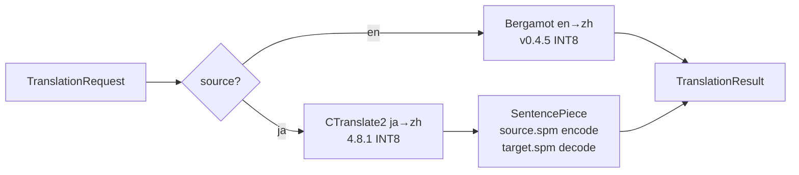

# 模块 07：vtrans-translation 翻译引擎

| 属性 | 值 |
|------|-----|
| Crate | `vtrans-translation` |
| 分支 | `feat/07-new-translate-model` |
| 上游依赖 | `vtrans-core`, `vtrans-models` |
| 层级 | 2 |
| 复杂度 | 高 |
| 阶段 | Phase 2（v0.3.0 起本地路径重构为双引擎原生） |

## 职责

实现 `TranslationProvider` trait，提供 API 翻译和本地双引擎翻译两种实现。

- API 翻译：OpenAI-compatible chat completions，支持取消、超时和有限次数重试。
- 本地翻译：Bergamot en→zh + CTranslate2 INT8 ja→zh 双引擎，通过 C++ C ABI 桥（`native/translation_bridge/`）接入；SentencePiece 子词编解码；质量档位 Fast / Balanced。

本地运行时 id 为 `"local-native"`（决策 A2）；旧 ONNX 单模型路径（`local_onnx.rs`）已彻底删除（决策 A3），不保留双维护。

## 公开 API

实现 `vtrans_core::TranslationProvider` trait。

```rust
/// 通用 HTTP/JSON API 翻译器
pub struct ApiTranslationProvider { /* ... */ }

impl ApiTranslationProvider {
    pub fn new(
        endpoint: &str,
        model: &str,
        api_key: &str,
        timeout: Duration,
        max_retries: u32,
    ) -> Self;
}

/// 本地多引擎翻译 Provider（Bergamot en-zh + CTranslate2 ja-zh）
pub struct NativeTranslationProvider { /* ... */ }

impl NativeTranslationProvider {
    /// 从 manifest v2 加载双引擎；阻塞重操作，须在 spawn_blocking 中调用
    pub fn from_manager(manager: &ModelManager) -> Result<Self, TranslationError>;
    /// 显式指定质量档位（缺省为 Fast，与 AppConfig.translation.quality 默认一致）
    pub fn with_quality(self, quality: TranslationQuality) -> Result<Self, TranslationError>;
}

/// 翻译质量档位：serde 表示 "fast" / "balanced"
pub enum TranslationQuality { Fast, Balanced }

/// 原生引擎句柄封装（Send + Sync，Drop 自动释放）
pub struct NativeTranslator { /* ... */ }

/// 校验语言对是否被支持
pub fn validate_language_pair(
    source: Language,
    target: Language,
    supported: &[(Language, Language)],
) -> Result<(), TranslationError>;
```

`TranslationProvider` 实现要点：

- `id()` 返回 `"local-native"`；`supported_pairs()` 返回 `[(en, zh-CN), (ja, zh-CN)]`。
- `translate()` 按 `request.source` 路由（en → Bergamot、ja → CTranslate2）；`Auto` 由上层（pipeline）解析为具体语言后传入，Provider 拒绝 `Auto` 与不支持对 → `TranslationError::UnsupportedPair`。
- 质量档位 → beam 映射（与 `native/translation_bridge/` 内实现保持一致）：Bergamot fast 1 / balanced 2；CTranslate2 fast 1 / balanced 4；`max_input_tokens` 恒为 256。

## 错误类型

> **定义位置**：`TranslationError` 定义在 `vtrans-core` 中（因为 `TranslationProvider` trait 需要引用它）。本模块从 `vtrans-core` 导入，不重新定义、不新增变体。

原生桥错误码映射（接入指南 §21，语义映射到现有变体）：

| 桥错误码 | 含义 | 映射 |
|---------|------|------|
| 0 | OK | 无 |
| 1 | invalid argument | `TranslationError::Inference` |
| 2 | unsupported language | `TranslationError::UnsupportedPair { src, target }` |
| 3 | model not loaded | `TranslationError::ModelLoad` |
| 4 | tokenizer failure | `TranslationError::ModelLoad` |
| 5 | inference failure | `TranslationError::Inference` |
| 6 | output encoding failure | `TranslationError::Inference` |
| 7 | version mismatch（DLL ABI 与 Rust 绑定不一致） | `TranslationError::ModelLoad` |

DLL 加载失败、符号缺失、ABI 版本不匹配、`translation_create` 返回 NULL、manifest 缺 translation 段 → `TranslationError::ModelLoad`。空文本 / 含 NUL 输入 / 桥输出非 UTF-8 / 空输出指针 → `TranslationError::Inference`。

## 内部文件结构

```text
crates/vtrans-translation/
├── Cargo.toml
├── README.md
├── src/
│   ├── lib.rs              # re-export
│   ├── api.rs               # ApiTranslationProvider（未改动）
│   ├── ffi.rs               # libloading 绑定 + 错误码映射 + NativeTranslator
│   ├── native.rs            # NativeTranslationProvider + TranslationQuality
│   ├── prompt.rs            # Prompt 模板构建（未改动）
│   ├── retry.rs             # 重试逻辑（未改动）
│   └── validate.rs          # 语言对校验（未改动）
├── examples/
│   └── translation_verify.rs # 双引擎 + API 双模式验证 CLI
└── tests/
    ├── api_provider.rs       # API 集成测试（未改动）
    ├── native_provider.rs    # 双引擎集成测试（#[ignore]，需真实模型 + DLL）
    └── fixtures/
        └── regression_samples.json  # 质量回归样本（指南 §27）

native/translation_bridge/   # C++17 C ABI 桥（Bergamot + CTranslate2 + SentencePiece）
├── CMakeLists.txt
├── build.ps1
├── translation_bridge.h
├── translation_bridge.cpp
└── README.md

licenses/                    # 引擎许可证登记（B6）：Bergamot MPL-2.0、CTranslate2 MIT、MarianMT/SentencePiece Apache-2.0
```

## 本地双引擎架构



- 生命周期：`translation_create` 在 Provider 构造时加载两个引擎，进程内常驻（指南 §15）；`translation_destroy` 在 Drop 时释放。
- 线程预算（B5）：Bergamot `cpu-threads=2`；CTranslate2 intra 2 / inter 1；桥内互斥锁串行化全部调用，总并发不随核心数膨胀。
- 文本通道：全部 UTF-8，禁止系统 ACP/ANSI 中转（指南 §20）。SentencePiece 使用模型自带 source/target spm，不混用其他模型词表（指南 §6.4）。
- 取消（B3）：原生推理不可中断 → `spawn_blocking` + 调用前检查 token + 调用完成后检查；取消返回 `TranslationError::Cancelled`；进行中的原生推理无法中断（README 已登记已知限制）。

## 日志

- 入口函数标注 `#[tracing::instrument]`；记录 `provider_id`、`model_id`、`source`/`target`、`quality`、`elapsed_ms`、`text_len`。
- 错误路径 `warn!`/`error!`。
- **禁止记录**：原文完整内容、译文完整内容、API Key；引用文本使用 `vtrans_core::truncate_for_log`，引用 Key 使用 `vtrans_core::mask_sensitive`。

## 测试计划

| 测试项 | 类型 | 说明 |
|--------|------|------|
| 语言对校验 | 单元 | Auto 源语言本地拒绝；不支持对返回错误 |
| Prompt 构建 | 单元 | 只要求译文，不含解释 |
| 超时映射 | 单元 | 超时返回 Timeout 错误 |
| 401 映射 | 单元 | HTTP 401 返回 Unauthorized |
| 429 映射 | 单元 | HTTP 429 返回 RateLimited |
| 重试逻辑 | 单元 | max_retries 次后放弃 |
| 取消传播 | 单元 | CancellationToken 触发后返回 Cancelled |
| 响应解析 | 单元 | JSON 响应提取译文 |
| 桥错误码映射 | 单元 | 0–7 全映射到现有 `TranslationError` 变体 |
| quality → beam 映射 | 单元 | Fast/Balanced → Bergamot 1/2、CTranslate2 1/4、max_input_tokens 256 |
| FFI 空指针/编码错误 | 单元 | null 输出指针、非法 UTF-8 输出、空文本、Auto/不支持源，均不触达真实 DLL |
| 双引擎真实回归 | 集成（`#[ignore]`） | en→zh 与 ja→zh 各 ≥1 条固定样本（`regression_samples.json`，断言 `expected_contains` 任一命中） |
| 验证 CLI | 手动 | `translation_verify --models <dir> --source en|ja --text ... [--quality fast|balanced]` |

## 验收标准

- [x] API Provider 可翻译中/日/英
- [x] Native Provider 可加载双引擎并翻译 en→zh / ja→zh（集成测试 `--ignored` 覆盖，需真实模型 + DLL）
- [x] 超时正确返回 Timeout
- [x] 取消正确返回 Cancelled（API 全覆盖；原生为调用前后检查，B3）
- [x] 401 返回 Unauthorized
- [x] 重试不超过 max_retries 次
- [x] API Key 从 CredentialManager 读取，不写明文
- [x] 本地模型加载失败给出明确错误（`ModelLoad`），不自动切换 API
- [x] 旧 ONNX 路径已删除（A3），`ort` 依赖未从 workspace 移除（仍由 vtrans-ocr 使用）
- [x] README.md 完整（双引擎架构、生命周期、取消语义、线程约束、已知限制）

## 开发注意事项

- API Provider 使用 reqwest，默认 rustls-tls；请求超时用 `tokio::time::timeout` 包装。
- `CancellationToken` 用 `tokio_util::sync::CancellationToken`。
- 重试使用指数退避（1s, 2s, 4s），429 不立即重试。
- 原生桥用 `libloading` 动态加载；DLL 查找顺序：模型目录同级 `native/` → 模型目录内 `native/` → 可执行文件旁 `native/` → 可执行文件旁 `resources/native/`。
- `unsafe` 代码块全部带 `// SAFETY:` 注释（模块级 `#![allow(unsafe_code)]`，与 vtrans-capture 惯例一致）。
- 日志记录 provider_id、model_id、elapsed_ms、source/target、text_len（不记录完整原文和译文）。
- DLL 构建产物输出到 `src-tauri/resources/native/`（打包声明由 10 任务在 `tauri.conf.json` 完成）；构建步骤见 `native/translation_bridge/README.md`。
